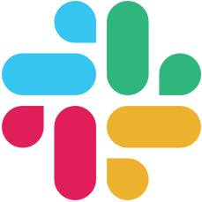
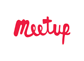

## ANNOUNCEMENTS
- Check out WeDoTDD.com for a list of companies that do TDD.  Companies must complete an interview to be added to the list.  Join their Slack channel and community.  This group has been added to our list of Events and Groups.
- ***JOIN US ON SLACK [{: .left-icon}](slack.md)*** - Click [here](slack.md).
- Sign up to pair with others (email ethanstrominger2@gmail.com to post your link here)
  - calend.ly/ethanstrominger/codewithme

## ABOUT BOSTON SOFTWARE CRAFTERS
Boston Software Crafters is a large and vibrant Software Crafters user group in the Boston area.  We meet the second Monday of the month. See [meetup.com/boston-software-crafters](https://meetup.com/Boston-Software-Crafters) for more details on the next event and to sign up.

The monthly hands on sessions are dedicated to learning and skill improvement through collaborative exercises that usually involve Test Driven Development, Pair Programming, and/or Mob Programming. It's a fun, passionate, group of developers committed to learning and helping others learn. I hope to see you there!

We use [Slack](slack.md) for online discussions.

All of our interactions are covered by our [code of conduct](code-of-conduct.md).

If you are an employer, you can [announce jobs](jobs.md).

Other ways to connect with Boston Software Crafters people:

[{: .left-icon}Slack](slack)

[{: .left-icon}Email the leaders](contact)

[{: .left-icon}Meetup](https://meetup.com/Boston-Software-Crafters)
